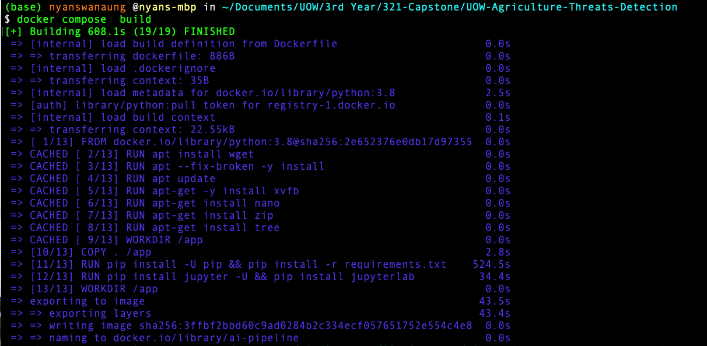
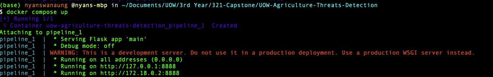

# UOW-Agriculture-Threats-Detection
Detecting weeds and plant disease using state of the art computer vision models

## How to Run with Docker

### 1 - Downloading model weight

Download trial6-best.onnx weight file from [here](https://drive.google.com/drive/folders/1wpiO5-o7OZ-W1bboAch4TgbDCmrnGBzk?usp=drive_link) and put in the **weights folder**


### 2 - Docker Requirements

Before you build Docker Image, make sure you have enough space in your system because the docker image will take 5GB of your storage.

- Storage - 8.75GB
- RAM - 4GB/8GB

The docker desktop version I tested is 4.0.1 (68347). However, you should be able to build image with latest docker destop too.

### 3 - Builing Docker Image

- go to the root dir (**UOW-AGRICULTURE-THREATS-DETECTION**)
- open docker desktop 
- run below command in your terminal to build docker image

```bash
docker compose build
```

After succesful build, you should be seeing something similar as shown below.

<br>

### 4 - Running Docker Container

To run your container, run below command

```bash
docker compose up
```

Open one of the IP addresses as shown in your terminal or type localhost:8888 and it will direct you to Flask Web Application.

<br>